# System Workflow

Design diagrams for the computer-use automation system for legacy bank back-office apps. These lock the design before implementation and are embedded in REPORT.md. Setup, test data, and the tests that prove each diagram are in [BUILD_MAP.md](BUILD_MAP.md).

## Legend

Every diagram uses the same four color classes.

| Class | Meaning | Color |
|---|---|---|
| `llm` | LLM involved (Claude makes the decision) | Purple |
| `det` | Deterministic code, no LLM | Blue |
| `human` | Human actor or human decision | Orange |
| `result` | Terminal result bucket or end state | Dark slate |

Sequence diagrams can't take Mermaid classes, so they reuse the same palette as background bands (`rect`). Orange marks human phases and purple marks LLM phases.

Canonical names used across all diagrams:

- Components: `CLI`, `DiscoveryAgent`, `Recorder`, `ArtifactStore`, `ReplayEngine`, `Surface`, `PlaywrightSurface`, `PolicyEngine`, `Redactor`, `SessionController`, `OperatorConsole`, `EvidenceSink`, `MockBankApp`
- Result buckets: `SUCCESS`, `BUSINESS_OUTCOME`, `ESCALATED`, `FAILURE`
- Control token states: `AUTOMATION`, `PAUSE_REQUESTED`, `HUMAN_IN_CONTROL`, `RESUME_REQUESTED`, `VERIFYING_CHECKPOINT`, `FAILED`, `CANCELLED`
- Artifact states: `DRAFT`, `APPROVED`, `DEPRECATED`
- Risk tiers: `READ`, `REVERSIBLE_WRITE`, `IRREVERSIBLE`

---

## 1. End-to-end pipeline

A natural-language goal goes through LLM-driven discovery once, and the successful run is recorded as a DRAFT capability artifact. After a human approves it, the artifact replays deterministically with no LLM in the loop. Every replay ends in exactly one of four result buckets.

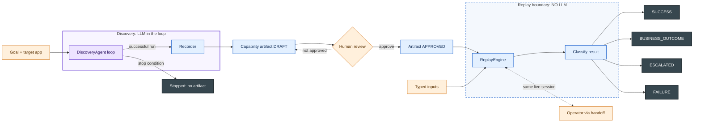

**Design notes**
- The LLM is used only during discovery. Replay is fully deterministic, so a replay result can be reproduced and audited.
- Discovery produces a DRAFT. Only a human-approved artifact (APPROVED) runs unattended.
- The operator connects to the same live browser session in both phases: during discovery when the agent is stuck, and during replay for blockers and irreversible approvals.
- Every replay ends in exactly one of four buckets. Recoverable conditions are handled inside `ReplayEngine` and never reach the classifier as failures.

---

## 2. Discovery loop

`DiscoveryAgent` runs observe, decide, act until the goal is met or a stop condition hits. `PolicyEngine` checks every proposed action before it reaches the UI, and every effect is verified before the step is recorded. If the agent makes no progress, it escalates to a human on the same session instead of guessing.

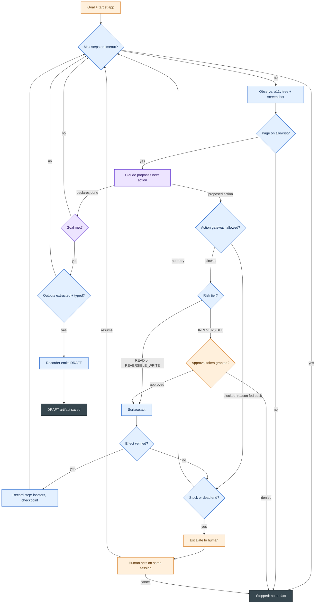

**Design notes**
- Stop conditions: max steps, wall-clock timeout, a page outside the allowlist, a denied irreversible action, or the operator cancelling. Any of these ends discovery with no artifact.
- The action gateway is deterministic. The LLM proposes, and `PolicyEngine` checks the domain, route, and action type before `Surface.act` runs. A blocked proposal is fed back to the LLM and counts toward stuck detection.
- Irreversible actions need the same human approval token in discovery as in replay. `open_sub_account` can't be recorded without a real, approved commit.
- A step is recorded only after its effect is verified. Each recorded step keeps the ranked locator candidates, pre and post checkpoints, and risk tier, with values passed through `Redactor`.
- "Goal met" is the LLM's claim, and a deterministic check confirms it: the outputs must be extracted and match the typed output schema.
- Human actions during escalation are captured as event types only. The next observation reflects what the human did.

---

## 3. Replay execution

`ReplayEngine` loads and validates the artifact, runs preflight, then executes each step with checkpoints, a locator ladder, a risk gate, outcome detectors, and recovery handlers. No LLM is called. Every exit path ends in exactly one of the four result buckets.

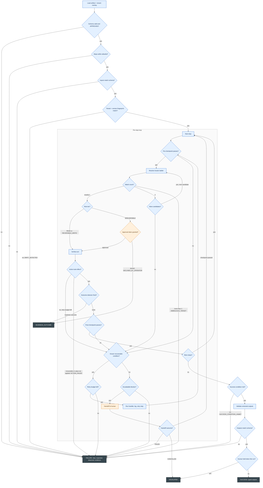

**Design notes**
- Preflight fails fast. Artifact schema and APPROVED status, the tenant overlay, allowlist coverage of every step, and the input schema are all checked before the UI is touched. The tenant and app version fingerprint is read right after the app opens, before step 1.
- Locator ladder: role+name, then label proximity, then text anchor plus table-relative position, then coordinates. Zero matches moves to the next candidate. More than one match stops immediately as `AMBIGUOUS_TARGET`, because clicking the wrong row in a bank app is worse than stopping.
- Outcome detectors run after every action, before the post-checkpoint. A "member not found" page fails the checkpoint, but it is a legitimate answer, not an error.
- Recoverable conditions (known dialog, slow load, transient app error) run a handler, get logged to `EvidenceSink`, and retry the step within a bounded budget. They never surface as failures unless the budget runs out.
- After a handoff, the engine resumes only after checkpoint verification. It continues at the next step if the human completed the blocked step, or retries the blocked step otherwise.
- Bucket precedence (a proposal, see Open questions): if a human held the control token at any point, a run that would otherwise be SUCCESS ends as ESCALATED, with outputs attached. SUCCESS always means fully unattended.
- Every action is verified. A FILL or SELECT whose value did not land (truncated, rejected) stops as `ACTION_FAILED`; a click that could not be performed (obscured, detached) is retried within budget. An irreversible action is never retried.
- The capability-level `success` checkpoint must hold after the last step before outputs are returned. Recovered conditions are listed on every result as `recoveries`, and sensitive outputs are masked in anything persisted.
- Any unanticipated exception still ends as a structured FAILURE (`UNEXPECTED_ERROR`) with evidence, so the one-bucket rule holds for every exit.

---

## 4. Error taxonomy

Each runtime condition maps to exactly one handling strategy and one result bucket. Conditions handled inside replay are logged and never surface as failures.

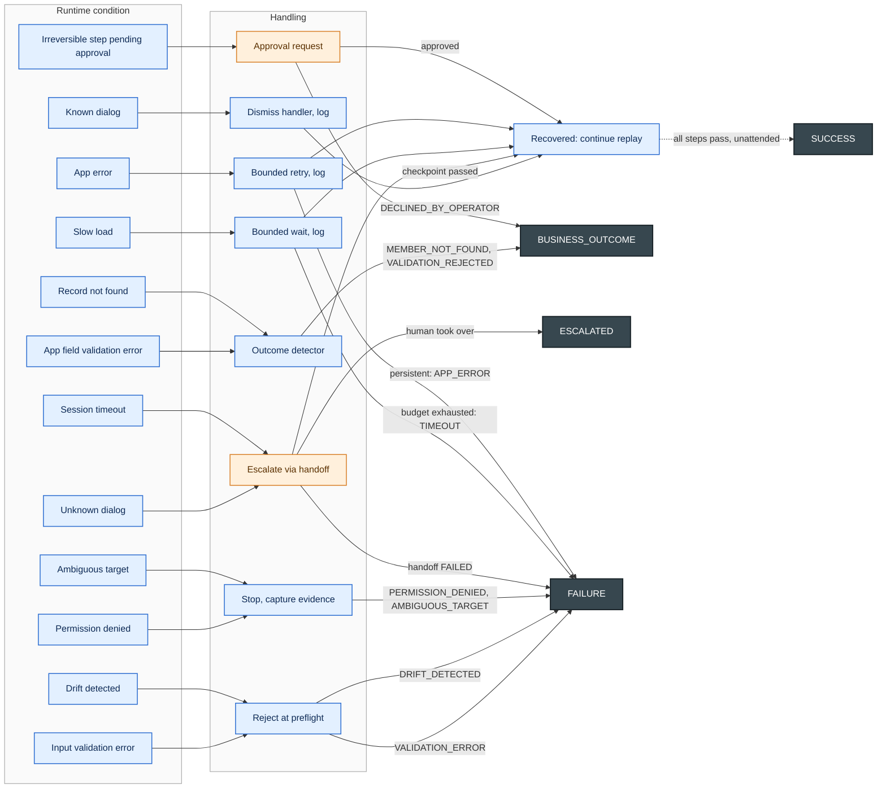

| Condition | Detected by | Handling | Bucket (reason code) |
|---|---|---|---|
| Input validation error | Preflight input schema | Reject before touching UI | FAILURE (`VALIDATION_ERROR`) |
| App field validation error | Outcome detector | Stop, return answer | BUSINESS_OUTCOME (`VALIDATION_REJECTED`) |
| Record not found | Outcome detector | Stop, return answer | BUSINESS_OUTCOME (`MEMBER_NOT_FOUND`) |
| Permission denied by the app | Outcome detector | Stop, capture evidence | FAILURE (`PERMISSION_DENIED`) |
| Step outside the allowlist, or entry point redirects off-list | PolicyEngine at preflight / start page | Stop before acting | FAILURE (`POLICY_VIOLATION`, stage `preflight` / `start_page`) |
| Known interstitial dialog | Recovery handler registry | Dismiss, log, retry step | None (recovered) |
| Unknown dialog | No handler matches | Escalate via handoff | ESCALATED, or FAILURE if handoff fails |
| Session timeout | Login page checkpoint | Escalate so human re-authenticates | ESCALATED, or FAILURE if handoff fails |
| Slow load | Checkpoint wait | Bounded wait, log | None, or FAILURE (`TIMEOUT`) when budget runs out |
| App error | Error page detector | Bounded retry if transient, log | None, or FAILURE (`APP_ERROR`) |
| Ambiguous target | Locator ladder (>1 match) | Stop immediately | FAILURE (`AMBIGUOUS_TARGET`) |
| Drift detected | Preflight fingerprint | Stop before any step | FAILURE (`DRIFT_DETECTED`) |
| Irreversible step pending approval | Risk gate | Approval request via handoff channel | Continue if approved, else BUSINESS_OUTCOME (`DECLINED_BY_OPERATOR`) |
| Known native alert/confirm | Surface dialog policy (detector pack) | Accept, log | None (recovered) |
| Unknown native alert/confirm | Surface dialog policy | Dismiss, stop | FAILURE (`UNRECOVERABLE_BLOCKER`) |
| Click intercepted (obscured, detached) | `ActionFailed` from the Surface | Bounded retry, log | None, or FAILURE (`ACTION_FAILED`) |
| Input not applied (truncated, rejected) | FILL read-back | Stop | FAILURE (`ACTION_FAILED`) |
| Redirect off the allowlist mid-flow | URL check while waiting on checkpoints | Stop | FAILURE (`POLICY_VIOLATION`, stage `mid_flow`) |
| Final page lacks success condition | Capability `success` checkpoint | Stop | FAILURE (`SUCCESS_CONDITION_UNMET`) |
| Anything unanticipated | Catch-all in `run()` | Stop, capture evidence | FAILURE (`UNEXPECTED_ERROR`) |

**Design notes**
- There are two kinds of validation error. A bad caller input is a FAILURE at preflight, and no UI is touched. The app rejecting a value (for example, a deposit below the minimum) is a legitimate business answer.
- Session timeout escalates rather than re-authenticating on its own. Credentials are used once, at session bootstrap over HTTP, and never enter artifacts, logs, the UI, or the model's context. Mid-run, the human signs in on the same session.
- Every FAILURE carries the step, expected, observed, and an evidence reference (a masked screenshot and a redacted DOM snapshot in `EvidenceSink`).
- Full reason code set in code (`cua.contracts`). FAILURE: `VALIDATION_ERROR`, `ARTIFACT_INVALID`, `ARTIFACT_NOT_APPROVED`, `PERMISSION_DENIED` (the app refused), `POLICY_VIOLATION` (our allowlist refused), `DRIFT_DETECTED`, `OVERLAY_REJECTED`, `AMBIGUOUS_TARGET`, `TARGET_NOT_FOUND`, `TIMEOUT`, `ACTION_FAILED`, `SUCCESS_CONDITION_UNMET`, `APP_ERROR`, `HANDOFF_FAILED`, `UNRECOVERABLE_BLOCKER`, `OUTPUT_INVALID`, `UNEXPECTED_ERROR`.
- Every row is exercised by the stress matrix in `tests/scenarios.py`; results are in `evidence/stress/SUMMARY.md`. BUSINESS_OUTCOME: `MEMBER_NOT_FOUND`, `VALIDATION_REJECTED`, `DECLINED_BY_OPERATOR`.
- A transient app error is never retried after an IRREVERSIBLE step, because a reload could resubmit the commit. It fails as `APP_ERROR` so a human can check the app.

---

## 5. Handoff control-token state machine

`SessionController` holds a single control token per live session. The token decides who may act on the browser, and automation actions are rejected unless the token is in `AUTOMATION`. Control returns to automation only through checkpoint verification.

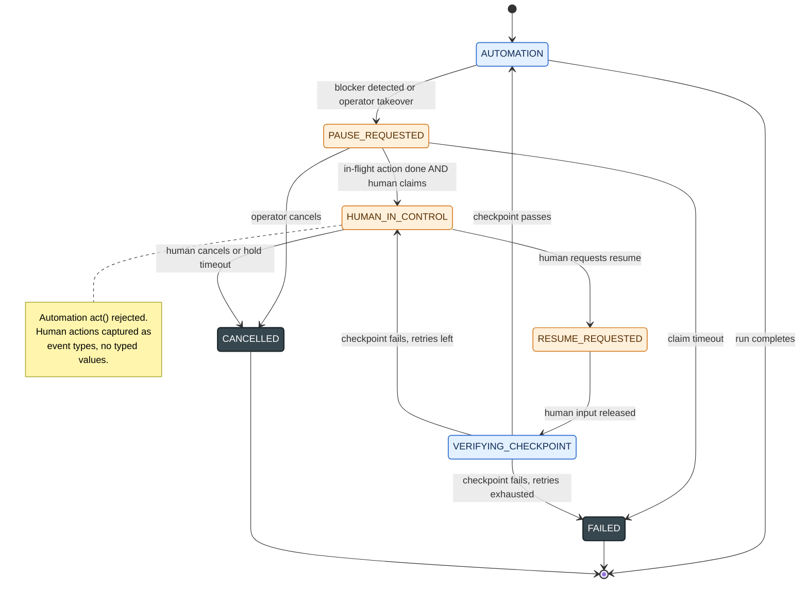

**Design notes**
- Token rule: `Surface.act` from automation succeeds only when the token is `AUTOMATION`. In every other state the action is rejected and logged.
- `PAUSE_REQUESTED` waits for the in-flight action to finish, so control never transfers mid-click. The human must claim within a claim timeout, or the handoff ends `FAILED`, which maps to FAILURE.
- Checkpoint verification decides where replay resumes. If the blocked step's post-checkpoint passes, replay continues at the next step. If the pre-checkpoint passes, it retries the blocked step. If neither passes, control goes back to the human, up to a retry limit.
- End mapping: `FAILED` maps to FAILURE and `CANCELLED` maps to ESCALATED, because a human took over and ended the run.
- The irreversible approval uses the same channel but does not transfer this token. The human approves and never drives the UI (see diagram 7).

---

## 6. Handoff sequence

This shows a replay blocker end to end: automation detects a blocker, the operator gets a masked intervention request, the token transfers, the human acts on the same browser, and automation resumes after checkpoint verification.

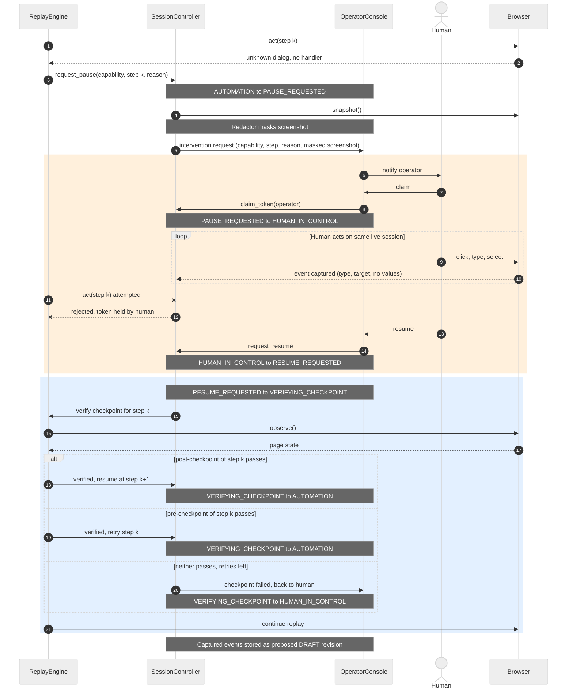

**Design notes**
- The human works in the same live browser session, so there is no re-login and no lost state, and the automation picks up exactly where the human left off.
- The intervention request carries only redacted data: capability name, step, reason, and a masked screenshot.
- Captured human actions record the event type and target only, never typed values. They can be proposed as a DRAFT artifact revision for review, and they never auto-merge.
- Rejected automation actions while the human holds the token are logged, which shows the token rule is enforced and not just advisory.

---

## 7. Irreversible action gate

For `open_sub_account`, replay pauses before the confirm step and asks the operator to approve the commit using a redacted summary. With no approval token, nothing is committed. A denial is a legitimate business answer, not a failure.

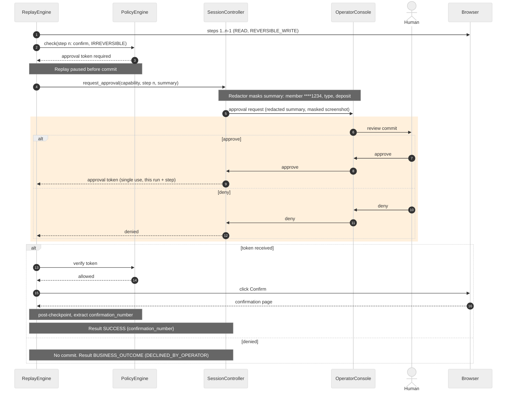

**Design notes**
- The risk tier is a property of each step in the artifact, and `PolicyEngine` enforces it at runtime. An artifact can't downgrade its own tier, and overlays can't touch it.
- Classification fails closed: a click is IRREVERSIBLE if it matches an explicit rule, if its label contains a commit keyword, or if it submits a POST form. That last signal needs no semantic markup, so it works on legacy apps.
- The approval token is single use and scoped to one run and one step. A token from an earlier run can't commit a later one.
- The approval uses the handoff channel but the control token stays with automation. The human approves and does not drive the UI, so an approved run with no takeover can still be SUCCESS.
- Denial maps to `BUSINESS_OUTCOME (DECLINED_BY_OPERATOR)`: the system worked correctly and the answer is "no".
- The same gate applies during discovery (diagram 2).

---

## 8. Multi-tenant resolution

Each vendor product has one base artifact, and each tenant has an overlay that can only remap labels and override locators. Preflight fingerprints the live tenant and app version against the merged artifact before any step runs.

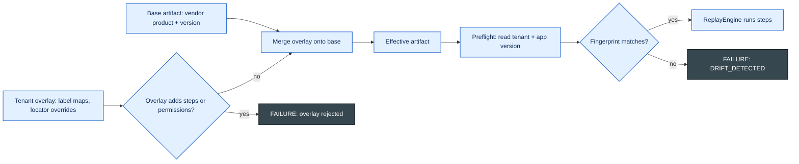

**Design notes**
- Overlays are restricted by construction. The overlay schema only allows label maps and locator overrides, so steps, risk tiers, allowlist entries, and outputs always come from the base.
- The effective artifact is computed and never hand-edited, so the same base and overlay always produce the same result.
- The fingerprint is read from the live app through `Surface.observe` before step 1. A mismatch in tenant or app version stops the run as `DRIFT_DETECTED` without touching the UI.
- One base artifact serves every tenant on the same vendor product, and per-tenant differences stay small and reviewable.

---

## 9. Artifact lifecycle

Each artifact version moves one way: DRAFT to APPROVED to DEPRECATED. Human actions captured during a handoff can be proposed as a new DRAFT version, and a reviewer must approve it before it can run unattended.

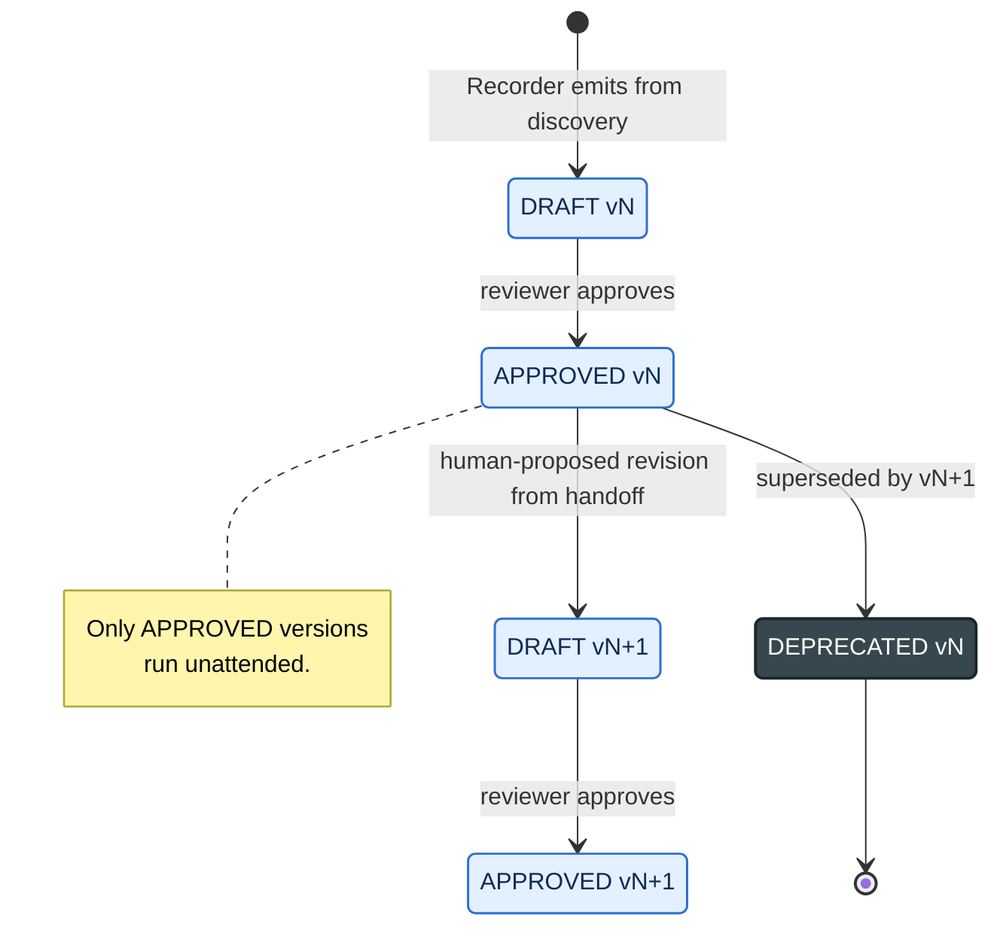

**Design notes**
- Versions are immutable. A revision is a new version (vN+1) with provenance pointing to its parent and to the handoff session it came from. vN is never edited in place.
- Approving vN+1 deprecates vN. Deprecated versions stay in `ArtifactStore` for audit and replay reproduction, but they can't be scheduled.
- A human-proposed revision starts as DRAFT like any other artifact. A human handoff never auto-promotes a change.
- Approval is always a human action, whether done through the CLI or `OperatorConsole`.

---

## 10. Component map

These are the components and their dependencies. The key seam is `Surface`: `DiscoveryAgent`, `ReplayEngine`, and `SessionController` depend only on the abstract interface, and `PlaywrightSurface` is the only component that knows about Playwright.

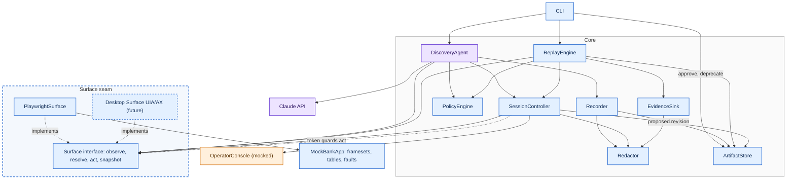

**Design notes**
- Artifacts store abstract target descriptors (ranked locator candidates), never Playwright handles. `Surface.resolve` turns a descriptor into a live target, so a future desktop Surface (UIA/AX) can replay the same artifact format.
- `DiscoveryAgent` is the only component that talks to Claude. `ReplayEngine` has no dependency on the LLM client at all, so "no LLM in replay" is enforced by the import graph.
- Everything that writes to disk (`Recorder`, `EvidenceSink`, and `SessionController` for masked screenshots) goes through `Redactor` first.
- `PolicyEngine` is shared by discovery and replay, so the allowlist and risk tiers are enforced by the same code in both phases.
- `SessionController` owns the control token and guards `Surface.act`. `OperatorConsole` is mocked for the take-home but talks to the controller through the same interface a real console would use.

---

## 11. Evals and telemetry

The system is measured at four points: always-on telemetry on the production path, a free deterministic replay eval in CI, a paid discovery eval with an LLM judge, and a calibration step that decides whether that judge may gate anything. All four feed one scorecard with gates, alerts, and trends. Details are in [EVALS.md](EVALS.md).

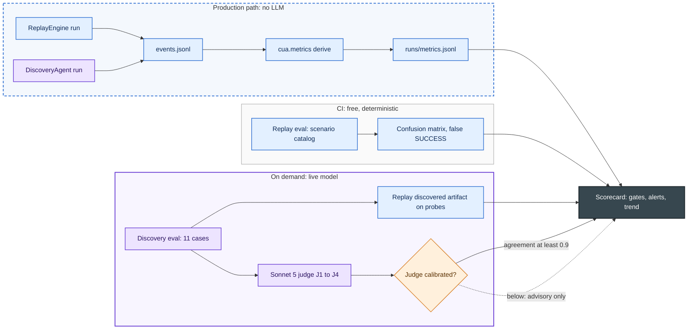

**Design notes**
- Telemetry is derived from events the run already writes, so the production path gains no LLM dependency and no extra calls. An import-graph test enforces this.
- The discovery eval grades the end state: the discovered artifact must replay like the golden one on probe inputs. The judge covers only what code cannot see.
- Allowlist refusals get their own reason code (`POLICY_VIOLATION`, with a stage), so "how often do we fail on allowlist issues" is a direct count.
- A rising locator fallback rate in the ledger warns about UI drift before any run fails.
- A server-side model fallback is recorded per turn and reported, never silently mixed into results.

---

## Open questions

The code implements the proposed default for each question below. Changing one means updating the tests marked "assumes OQ#n" in [BUILD_MAP.md](BUILD_MAP.md).

1. **ESCALATED vs SUCCESS after a resumed handoff.** Proposed: if a human held the control token at any point, the run ends ESCALATED (with outputs attached if extracted), so SUCCESS always means fully unattended. Confirm, or should a resumed run that completes count as SUCCESS with the escalation logged in provenance?
2. **Permission denied bucket.** Proposed: FAILURE (`PERMISSION_DENIED`), since it points to a config or entitlement problem rather than an answer about the member. Should an app-side "not authorized for this member" be a BUSINESS_OUTCOME instead?
3. **Validation errors.** Proposed split: a bad caller input is FAILURE at preflight, and an app-side field rejection is BUSINESS_OUTCOME (`VALIDATION_REJECTED`). Is `VALIDATION_REJECTED` an acceptable reason code, or should app validation be a FAILURE?
4. **Approval timeout.** What happens if nobody approves or denies an irreversible step? The diagrams guarantee no commit without a token but don't define a deadline. Implemented: FAILURE (`HANDOFF_FAILED`), nothing committed.
5. **Handoff timeouts.** Values are needed for the claim timeout (`PAUSE_REQUESTED`), the hold timeout (`HUMAN_IN_CONTROL`), and the checkpoint retry limit (`VERIFYING_CHECKPOINT`). Proposed mapping: claim timeout ends FAILED, hold timeout ends CANCELLED.
6. **Which blockers escalate vs fail?** Proposed: an unknown dialog and a session timeout escalate. Ambiguous target, drift, and a persistent app error fail immediately. Implemented: an exhausted ladder waits within the slow-load budget, then fails as `TARGET_NOT_FOUND`.
7. **Redaction before the LLM.** Is the observation (a11y tree and screenshot) redacted before it is sent to Claude during discovery, or only before it is persisted? Implemented: yes. Page text sent to Claude is redacted and the screenshot is masked.
8. **Rejected DRAFTs.** The lifecycle has no REJECTED state. Does a DRAFT that is not approved just stay DRAFT, or is it deleted? Implemented: a DRAFT stays DRAFT, and `cua replay --attended` can run it with an operator present.
9. **Overlay lifecycle.** Do tenant overlays have their own DRAFT/APPROVED versioning, and does changing an overlay require re-approval of the effective artifact?
10. **Goal-met verification in discovery.** Is the LLM's "done" claim plus a typed output extraction enough, or should the caller supply an explicit success checkpoint with the goal? Implemented: `done` plus typed extraction of every output.
